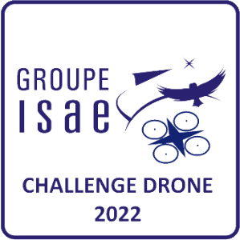
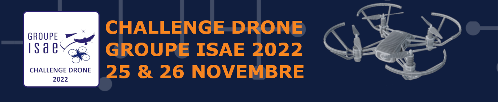
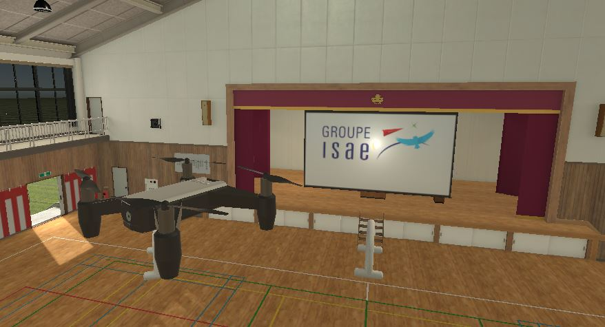

# Tello UAV Simulator



Small Racing UAV Simulator made for the _ISAE Drone Challenge 2022_

## Table of Contents

- [Table of Contents](#table-of-contents)
- [Download Links](#download-links)
- [Where are the source files?](#where-are-the-source-files)
- [Network communication](#network-communication)
- [How to control the Tello](#how-to-control-the-tello)
- [SDK Control](#sdk-control)
- [Data Reception](#data-reception)
- [Manual Control](#manual-control)
- [Creating new levels](#creating-new-levels)
- [Recorded best times](#recorded-best-times)
- [Contact](#contact)




Unity version used for this project: **2021.3.6f1**

## Download Links

- [Windows](https://github.com/PYBrulin/UAV-Tello-Simulator/releases/download/v1.0.1/Win64-v1.0.1.zip) (and [x86](https://github.com/PYBrulin/UAV-Tello-Simulator/releases/download/v1.0.1/Win-v1.0.1.zip))
- [MacOS](https://github.com/PYBrulin/UAV-Tello-Simulator/releases/download/v1.0.1/MacOS.app.zip)
- [Linux](https://github.com/PYBrulin/UAV-Tello-Simulator/releases/download/v1.0.1/Linux-v1.0.1.zip)

## Where are the source files?

Since this simulation uses paid/licensed resources (the drone model and the gym, mainly), the release of the source code is naturally restricted. This is also the reason why this repository does not currently display any licenses for the available files.

It is expected that the source code will be released once the assets have been replaced and that it will be under a permissive license.

## Network communication

Unlike a physical _Tello_ drone, the connection to the drone is established differently, since the simulator and the controller run on the same local machine.

Sending commands and receiving responses are done from two separate ports. The virtual _Tello_ receives commands from the remote controller using port `8889` and sends acknowledgement responses using port `9000` as opposed to a physical _Tello_ which would respond on the same port (but using a different IP address than the client).

```c
    DJITelloPY client                       Virtual Tello
    127.0.0.1           (All local)         127.0.0.1
        commands        ---'8889'-->
                        <--'9000'---    responses
                        <--'8890'---    state packets
                        <--'8891'---    debug packets [optional]
                        <--'11111'--    video stream
```

To better understand the difference here is the same diagram when communicating with a physical _Tello_:

```c
    DJITelloPY client                       Physical Tello
    192.168.10.X                            192.168.10.1
        commands        <--'8889'-->    responses
                        <--'8890'---    state packets
                        <--'11111'--    video stream
```

## How to control the Tello

The environment has been created to act as a standalone _Tello_ capable of responding to most of the _Tello_ commands defined in its SDK. Thus, to control the _simulated_ Tello drone, you need to use a library capable of controlling a _Tello_ drone:

- [My fork of the DJITelloPy python interface](https://github.com/PYBrulin/DJITelloPy) that takes into account the modifications needed to work with the simulator, originally written by [damiafuentes](https://github.com/damiafuentes/DJITelloPy);
- A [Matlab/Simulink control implementation](https://gitlab.isae-supaero.fr/l.ribeiro-lustosa/isae-group-drone) which uses this simulator;

(Adapting an existing Tello interface for use with this simulator is relatively straight forward since only the response port needs to be modified.)

## SDK Control

Most commands described in the _Tello SDK 2.0 User Guide_ are implemented for controlling the simulated _Tello_. Refer to the [official documentation](https://dl-cdn.ryzerobotics.com/downloads/Tello/Tello%20SDK%202.0%20User%20Guide.pdf).

1.  Control Commands

    - `command`: Enter SDK mode
    - `takeoff`: Auto takeoff
    - `land`: Auto landing
    - `streamon`: Enable video stream
    - `streamoff`: Disable video stream
    - `emergency`: Stop motors immediately
    - `up`: x Ascend to “x” cm.
    - `down`: x down “x” Descend to “x” cm.
    - `left`: x Fly left for “x” cm.
    - `right`: x Fly right for “x” cm.
    - `forward`: x Fly right for “x” cm.
    - `back`: x Fly right for “x” cm. “x” = 20-500
    - `cw`: cw x Rotate “x” degrees clockwise.
    - `ccw`: ccw x Rotate “x” degrees counterclockwise. “x” = 1-360
    - `flip`: Flip in “x” direction. (“l” = left / “r” = right / “f” = forward / “b” = back)
    - `stop`: Stop the drone movement instantly
    - `go`: Fly to “x” “y” “z” at “speed” (cm/s). ( “x” = -500-500 / “y” = -500-500 / “z” = -500-500 / “speed” = 10-100). Note: “x”, “y”, and “z” values can’t be set between -20 – 20 simultaneously
    - `curve`: Fly at a curve according to the two given coordinates of the Mission Pad ID at “speed” (cm/s). If the arc radius is not within a range of 0.5-10 meters, it will respond with an error. (“x1”, “x2” = -500-500 / “y1”, “y2” = -500-500 / “z1”, “z2” = -500-500 / “speed” = 10-60) Note: “x”, “y”, and “z” values can’t be set between -20 – 20 simultaneously

    Note: Mission pads specific commands are not implemented

1.  Set Commands

    - `speed`: Set speed to “x” cm/s.
      x = 10-100
    - `rc`: Set remote controller control via four channels.
      (“a” = left/right (-100-100) / “b” = forward/backward (-100-100) / “c” = up/down (-100-100) / “d” = yaw (-100-100))

1.  Camera Set Commands

    - `setresolution`: Sets the resolution of the video stream (low, high)
    - `setfps`: Sets the frames per second of the video stream (low, medium, high)

1.  Read commands

    - `speed?`: Obtain current speed (cm/s). “x” = 10-100
    - `battery?`: Obtain current battery percentage. “x” = 0-100
    - `time?`: Obtain current flight time. “time”
    - `height?`: Obtains height in cm between 0-3000
    - `temp?`: Obtains temperature integer between 0-90
    - `attitude?`: Obtains {'pitch': int, 'roll': int, 'yaw': int}
    - `baro?`: Obtains barometer height in cm between 0-100
    - `tof?`: Obtains distance value from TOF in cm between 30-1000
    - `wifi?`:Obtain Wi-Fi SNR. “snr”
    - `sdk?`:Obtain the Tello SDK version. “sdk version”
    - `sn?`: Obtain the Tello serial number. “serial number"

1.  Helper commands - Unrelated to Tello but useful for the simulation
    - `screenshot`: Takes a screenshot of the current view
    - `reload` and `reset`: Reset the World

## Data Reception

The state packets come from port `8890`, and should be easy to capture if you use an open-source library to control the Tello.
The state packet is sent at a frequency of 10Hz and contains the following data:

<!-- Mission Pad field, not activated by default :
- `mid`: the ID of the Mission Pad detected. If no Mission Pad is detected, a “-1” message will be received instead.
- `x`: the “x” coordinate detected on the Mission Pad. If there is no Mission Pad, a “0” message will be received instead.
- `y`: the “y” coordinate detected on the Mission Pad. If there is no Mission Pad, a “0” message will be received instead.
- `z`: the “z” coordinate detected on the Mission Pad. If there is no Mission Pad, a “0” message will be received instead.  -->

| _Name_  | Description                                  |
| :------ | :------------------------------------------- |
| `pitch` | the degree of the attitude pitch.            |
| `roll`  | the degree of the attitude roll.             |
| `yaw`   | the degree of the attitude yaw.              |
| `vgx`   | the speed of “x” axis.                       |
| `vgy`   | the speed of the “y” axis.                   |
| `vgz`   | the speed of the “z” axis.                   |
| `templ` | the lowest temperature in degree Celsius.    |
| `temph` | the highest temperature in degree Celsius    |
| `tof`   | the time of flight distance in cm.           |
| `h`     | the height in cm.                            |
| `bat`   | the percentage of the current battery level. |
| `baro`  | the barometer measurement in cm.             |
| `time`  | the amount of time the motor has been used.  |
| `agx`   | the acceleration of the “x” axis.            |
| `agy`   | the acceleration of the “y” axis.            |
| `agz`   | the acceleration of the “x” axis.            |

In addition, there is an optional _debug_ packet that we need to send in parallel to the status packet that contains more data on port `8890`. It is currently sent at 30Hz and contains the following data:

| _Name_    | Description                                    |
| :-------- | :--------------------------------------------- |
| `world_x` | the actual position of the drone in the world. |
| `world_y` | the actual position of the drone in the world. |
| `world_z` | the actual position of the drone in the world. |

## Manual Control

It is also possible to control the drone manually using the keyboard or a gamepad (e.g. XBox controller).

Using the keyboard, use the following keys to control the drone :

- `T`: Takeoff
- `L`: Land
- `ZQSD` (`WASD`) : Roll & Pitch
- `RW` (`RZ`) : Throttle & Yaw.
- `AE` (`QE`): Yaw

Using a gamepad, the control corresponds to a drone radio control in _Mode 2_, i.e. `left stick`: throttle and yaw; and `right stick`: pitch and roll. Specific inputs have also been added: `A` to take off and `B` to land.

## Creating new levels

The levels are defined from XML definition files available for the challenge in the build folder under :

- (Windows) `Win64\Tello_Simulator_Data\StreamingAssets`
- (MacOS) `macOS\Tello_Simulator.app\Contents\Resources\Data\StreamingAssets`
- (Linux) `Linux\Tello_Simulator_Data\StreamingAssets`

The root object `LevelData` contains all the components necessary to define a scene:

- Its `name` needed to record the best track time.
- The `respawnPoint` where the vehicle should respawn (at the beginning of the scene or when the simulation has restarted);
- The `startLine` of the race track;
- The `finishLine` of the race track;
- The `gate array` distributed in the scene. A `door` is defined by its type, its sequence index and its position in the scene;

Here is an example of a level definition to build a level:

```xml
<?xml version="1.0"?>
<LevelData>
    <!-- Description  -->

    <!-- Name of the challenge (Used to record best time) -->
    <name>Challenge 0</name>

    <!-- The starting point of the the UAV within the level -->
    <respawnPoint>
        <!-- Position within the level -->
        <position>
            <x>0</x>
            <y>0.35</y>
            <z>0</z>
        </position>

        <!-- Rotation of the object within the level (in degrees) -->
        <!-- To rotate the object parallel to the ground, modify the y-component only  -->
        <rotation>
            <x>0</x>
            <y>0</y>
            <z>0</z>
        </rotation>
    </respawnPoint>

    <!-- The Start Line position within the level -->
    <startLine>
        <position>
            <x>0</x>
            <y>0</y>
            <z>6</z>
        </position>
        <rotation>
            <x>0</x>
            <y>0</y>
            <z>0</z>
        </rotation>
    </startLine>

    <!-- The Finish Line position within the level -->
    <finishLine>
        <position>
            <x>0</x>
            <y>0</y>
            <z>38</z>
        </position>

        <rotation>
            <x>0</x>
            <y>0</y>
            <z>0</z>
            <w>0</w>
        </rotation>
    </finishLine>

    <!-- Gate circuit array -->
    <gates>

        <!-- First Gate -->
        <gate index="0">
            <!-- index of the gate -->
            <index>0</index>
            <!-- type of the gate -->
            <!-- 0: Arch -->
            <!-- 1: TV -->
            <!-- 2: I-Turn Left -->
            <!-- 3: I-Turn Right -->
            <!-- 4: I-Turn Center -->
            <type>0</type>
            <position>
                <x>0</x>
                <y>0</y>
                <z>12</z>
            </position>

            <rotation>
                <x>0</x>
                <y>0</y>
                <z>0</z>
            </rotation>
        </gate>

        <!-- Second Gate -->
        <gate index="1">
            <index>1</index>
            <type>0</type>
            <position>
                <x>0</x>
                <y>0</y>
                <z>20</z>
            </position>
            <rotation>
                <x>0</x>
                <y>0</y>
                <z>0</z>
            </rotation>
        </gate>

        <!-- Etc -->

    </gates>

</LevelData>
```

<!-- TODO : Add a Python script to generate the levels -->

## Recorded best times

The best recorded times are saved machine wise under:

`C:\Users\[USER]\AppData\LocalLow\ESTACA_ISAE\Tello Simulator\save_time.csv`

You can safely delete this file if you want to reset all your recorded times.
Do not cheat by modifying this file!

## Contact

In case of a problem or feedback regarding this simulator, you can contact: "pierre-yves.brulin@estaca.fr" or "fouad.khenfri@estaca.fr"
